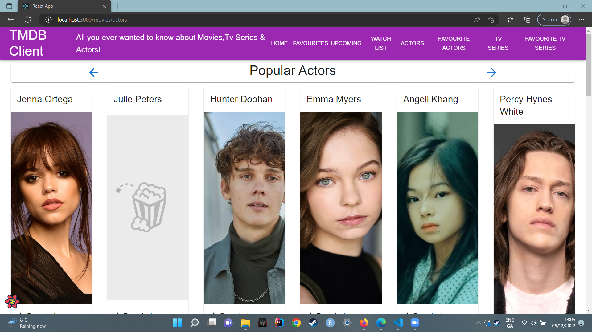
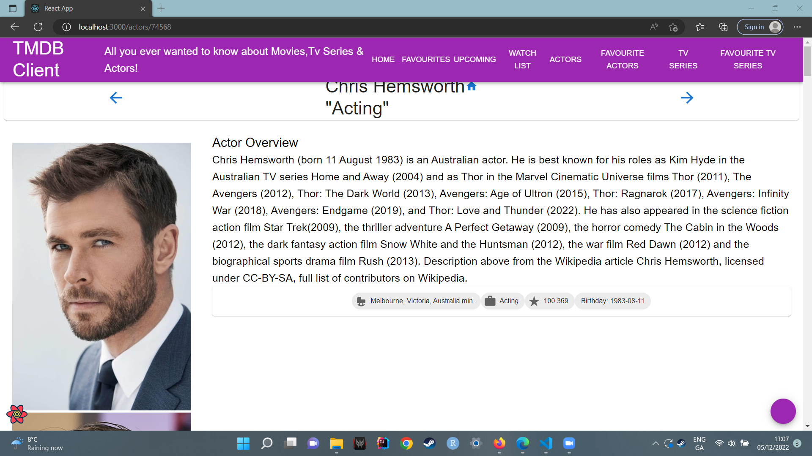
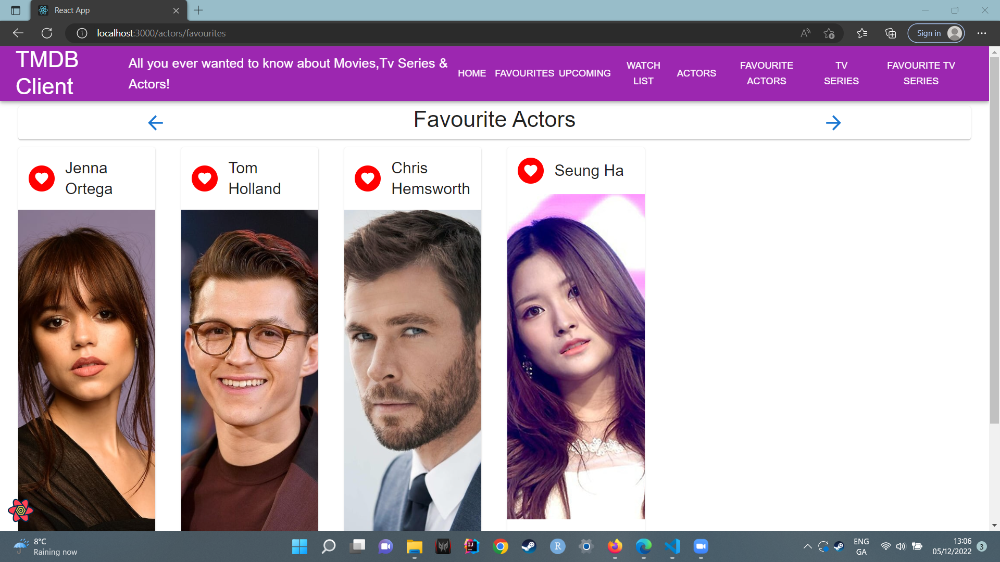
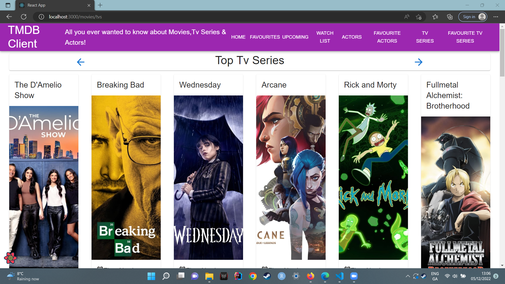
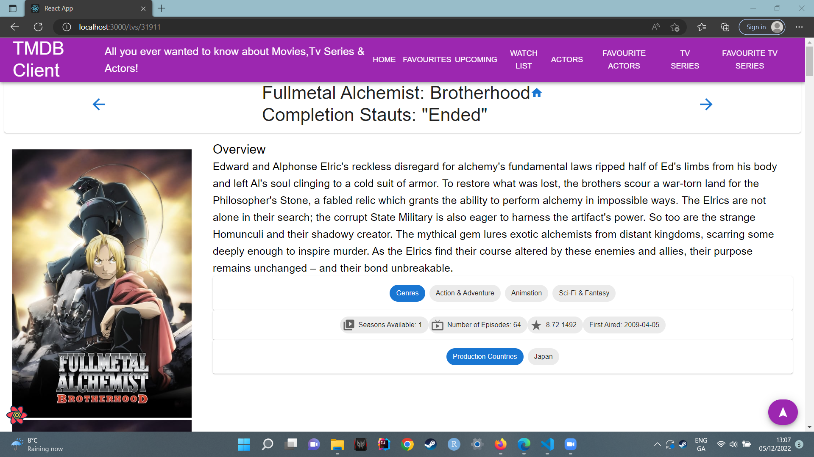

# Web App Dev 2 - Assignment 1 - ReactJS app.

Name: Rebecca Finnegan (Student Number: 20093862)

## Overview.

### New Pages.

+ List of Popular Actors
+ Actor Details.
+ Favourite Actors.
+ List of Top Rated TV Series.
+ TV Series Details.
+ Favourite TV Series.

### New Features.

+ Popular Actors List with relevant overviews and extra information
+ Adding Actors to a favourite list. Clicking "More Info" will take user to a page with the Actor's details.
+ Top Rated TV Series list with relevant overviews and extra information
+ Adding TV series to a favourite list. Clicking "More Info" will take user to a page with the Series details.

## Setup requirements.

None

## TMDB endpoints.

+ /movies/actors - Popular Actors list.
+ /movies/actors/favourites - List of actors that the user favourited.
+ /movies/tvs - Top rated TV series list.
+ /movies/tvs/favourites - List of TV series that the user favourited.
+ /actors/{actor_id) - Actor details.
+ /tvs/{tv_id} - TV series details.

## App Design.

### Component catalogue.

None

### UI Design.

[ Insert screenshots of the __new app pages__ you developed (including modified existing pages), Have an appropriate caption for each one (see example below).

>Shows basic list of popular actors with small amount of information such as popularity, can add to favourites here or view more detailed information.

>Shows detailed information on an actor, such as birthplace, biography overview and birthday.

>Shows the list of actors favourited by the user.

>Shows basic list of the top rated tv series with small amount of information such as first airing and popularity, can add to favourites here or view more detailed information.

>Shows detailed information on a series, such as genre, number of seasons and episodes, show status, air date, popularity and production countires.

>Shows the list of TV series favourited by the user.

### Routing.

+ /movies/actors - List of popular actors.
+ /movies/actors/favourites - Shows actors favourited by the user.
+ /movies/tvs - List of top rated TV series.
+ /movies/tvs/favourites - Shows TV series favourited by the user.
+ /actors/{actor_id} - actor details.
+ /tvs/{tv_id} - tv series details.
+ etc.

## Independent learning (If relevant).

Not relevant

